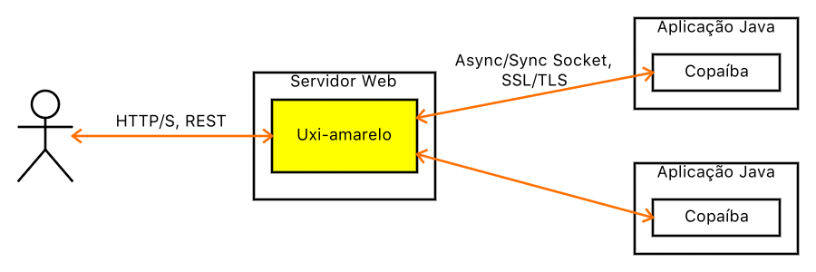

# Uxi-amarelo

Interface Web para [Unha-de-gato](http://joseflavio.com/unhadegato).

Web interface for [Unha-de-gato](http://joseflavio.com/unhadegato).

## Descrição

A Uxi-amarelo é uma aplicação Web que permite a comunicação com [Unha-de-gato](http://joseflavio.com/unhadegato) através de protocolos comuns, tais como HTTP e REST, ampliando as possibilidades de manipulação de dados expostos com [Copaíba](http://joseflavio.com/copaiba).

A figura a seguir ilustra o escopo de aplicação da Uxi-amarelo:



## Versão Atual

1.0-A10

Padrão de versionamento: [JFV](http://joseflavio.com/jfv)

## Requisitos

* Git >= 2.8
* Java >= 1.8
* Gradle >= 3.1
* Apache TomEE Plus >= 1.7.3

## Instalação

Para implantar a Uxi-amarelo, basta instalar o arquivo [uxiamarelo.war](https://github.com/joseflaviojr/uxiamarelo/releases/download/1.0-A10/uxiamarelo.war) num servidor Web que implemente a especificação JavaEE, como o [Apache TomEE](http://tomee.apache.org/).

## Desenvolvimento

Configuração do projeto para Eclipse e IntelliJ IDEA:

```sh
gradle eclipse
gradle cleanIdea idea
```

## Compilação

Para compilar o projeto, gerando o arquivo WAR, executar no terminal:

```sh
gradle clean build
```